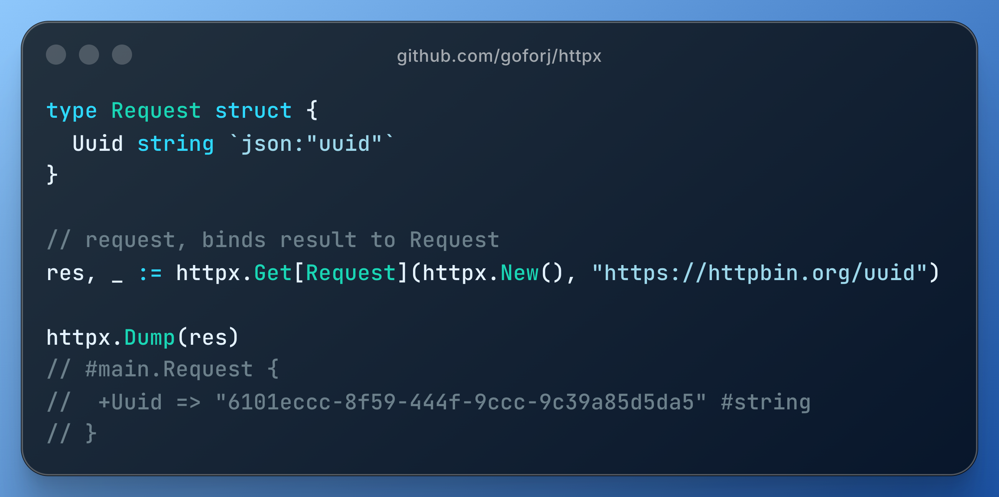

<p align="center">
  
</p>

A generics-first HTTP client wrapper for Go, built on top of the amazing `github.com/imroc/req/v3` library.
It keeps req's power and escape hatches, while making the 90% use case feel effortless.

<p align="center">
    <a href="https://pkg.go.dev/github.com/goforj/httpx"></a>
    <a href="LICENSE"></a>
    <a href="https://github.com/goforj/httpx/actions"></a>
    <a href="https://golang.org"></a>
    
    <a href="https://goreportcard.com/report/github.com/goforj/httpx"></a>
    <a href="https://codecov.io/gh/goforj/httpx" ></a>
<!-- test-count:embed:start -->
    
<!-- test-count:embed:end -->
</p>

<p align="center">
  
</p>

## v2 Status

httpx v1 has been tagged and is now frozen. The `main` branch is v2, which includes intentional breaking changes to improve API clarity and ergonomics (for example, request helpers return `(T, error)`).

## Why httpx

- Typed, zero-ceremony requests with generics.
- Opinionated defaults (timeouts, result handling, safe error mapping).
- Built on req, with full escape hatches via `Client.Req()` and `Client.Raw()`.
- Ergonomic options for headers, query params, auth, retries, dumps, and uploads.

## Install

```bash
go get github.com/goforj/httpx
```

## Quick Start

```go
package main

import (
	"context"
	"fmt"
	"net/http"

	"github.com/goforj/httpx"
	"github.com/imroc/req/v3"
)

func main() {
	c := httpx.New()

	// Simple typed GET.
	res, err := httpx.Get[map[string]any](c, "https://httpbin.org/get")
	if err != nil {
		panic(err)
	}
	fmt.Println(res)

	// Context-aware GET.
	ctx := context.Background()
	res2, err := httpx.GetCtx[map[string]any](c, ctx, "https://httpbin.org/get")
	if err != nil {
		panic(err)
	}
	fmt.Println(res2)

	// Access the underlying response when you need it.
	r := req.C().R()
	r.SetURL("https://httpbin.org/get")
	r.Method = http.MethodGet
	res3, resp, err := httpx.Do[map[string]any](r)
	if err != nil {
		panic(err)
	}
	fmt.Println(res3)
	fmt.Println(resp.Status)
}
```

## v2 Error Handling

httpx v2 returns errors as the second return value from request helpers.

```go
res, err := httpx.Get[map[string]any](c, "https://httpbin.org/get")
if err != nil {
	return err
}
_ = res
```

## Browser Profiles

Browser profiles provide a simple way to match common client behavior without exposing low-level details.
Internally, profiles may apply transport and protocol settings as needed, but those details are intentionally abstracted.

```go
c := httpx.New(httpx.AsChrome())
_ = c
```

## Use Any req Feature

**httpx** is built on top of the incredible [req](https://github.com/imroc/req) library, and you can always drop down to it when you need something beyond httpx’s helpers. That means every example in req’s docs is available to you with `c.Req()` or `c.Raw()`.

While httpx provides ergonomic helpers for the most common use cases, req is a powerful and flexible HTTP client library with tons of features.

```go
c := httpx.New()

// Grab the underlying req client.
rc := c.Req()

// Now you can use any req feature from their docs.
// Example: enable trace, custom transports, cookie jars, proxies, etc.
rc.EnableTraceAll()
```

See the full req documentation here: https://req.cool/docs/prologue/quickstart/

Most users will only need the high-level APIs (browser profiles, request composition, retries, uploads).
When you need deep control over headers, transports, or protocol behavior, `req` is always there.

## Options in Practice

```go
c := httpx.New(httpx.BaseURL("https://httpbin.org"))

res, err := httpx.Get[map[string]any](
	c,
	"/anything/{id}",
	httpx.Path("id", "42"),
	httpx.Query("include", "teams", "active", "1"),
	httpx.Header("Accept", "application/json"),
)
if err != nil {
	panic(err)
}
_ = res
```

## Debugging and Tracing

- `HTTP_TRACE=1` enables request/response dumps for all requests.
- `httpx.EnableDump()` enables dump for a single request.
- `httpx.DumpEachRequest()` enables per-request dumps on a client.

## Examples

All runnable examples are generated from doc comments and live in `./examples`.
They are compiled by `example_compile_test.go` to keep docs and code in sync.

## Contributing

- Run `go run ./docs/examplegen` after updating doc examples.
- Run `go run ./docs/readme/main.go` to refresh the API index and test count.
- Run `go test ./...`.

<!-- api:embed:start -->

## API Index

| Group | Functions |
|------:|:-----------|
| **Auth** | [Auth](#auth) [Basic](#basic) [Bearer](#bearer) |
| **Browser Profiles** | [AsChrome](#aschrome) [AsFirefox](#asfirefox) [AsMobile](#asmobile) [AsSafari](#assafari) |
| **Client** | [Default](#default) [New](#new) [Raw](#raw) [Req](#req) |
| **Client Options** | [BaseURL](#baseurl) [CookieJar](#cookiejar) [ErrorMapper](#errormapper) [Middleware](#middleware) [Proxy](#proxy) [ProxyFunc](#proxyfunc) [Redirect](#redirect) [Transport](#transport) |
| **Debugging** | [Dump](#dump) [DumpAll](#dumpall) [DumpEachRequest](#dumpeachrequest) [DumpEachRequestTo](#dumpeachrequestto) [DumpTo](#dumpto) [DumpToFile](#dumptofile) [EnableDump](#enabledump) [Trace](#trace) [TraceAll](#traceall) |
| **Download Options** | [OutputFile](#outputfile) |
| **Errors** | [Error](#error) |
| **Request Composition** | [Body](#body) [Form](#form) [Header](#header) [JSON](#json) [Path](#path) [Query](#query) [UserAgent](#useragent) |
| **Request Control** | [Before](#before) [Timeout](#timeout) |
| **Requests** | [Delete](#delete) [Do](#do) [Get](#get) [Head](#head) [Options](#options) [Patch](#patch) [Post](#post) [Put](#put) |
| **Requests (Context)** | [DeleteCtx](#deletectx) [GetCtx](#getctx) [HeadCtx](#headctx) [OptionsCtx](#optionsctx) [PatchCtx](#patchctx) [PostCtx](#postctx) [PutCtx](#putctx) |
| **Retry** | [RetryBackoff](#retrybackoff) [RetryCondition](#retrycondition) [RetryCount](#retrycount) [RetryFixedInterval](#retryfixedinterval) [RetryHook](#retryhook) [RetryInterval](#retryinterval) |
| **Retry (Client)** | [Retry](#retry) |
| **Upload Options** | [File](#file) [FileBytes](#filebytes) [FileReader](#filereader) [Files](#files) [UploadCallback](#uploadcallback) [UploadCallbackWithInterval](#uploadcallbackwithinterval) [UploadProgress](#uploadprogress) |
| **Advanced** | [TLSFingerprint](#tlsfingerprint) [TLSFingerprintAndroid](#tlsfingerprintandroid) [TLSFingerprintChrome](#tlsfingerprintchrome) [TLSFingerprintEdge](#tlsfingerprintedge) [TLSFingerprintFirefox](#tlsfingerprintfirefox) [TLSFingerprintIOS](#tlsfingerprintios) [TLSFingerprintRandomized](#tlsfingerprintrandomized) [TLSFingerprintSafari](#tlsfingerprintsafari) |


## Auth

### <a id="auth"></a>Auth

Auth sets the Authorization header using a scheme and token.

```go
// Apply to all requests
c := httpx.New(httpx.Auth("Token", "abc123"))
res, err := httpx.Get[map[string]any](c, "https://httpbin.org/headers")
_ = err
httpx.Dump(res) // dumps map[string]any
// #map[string]interface {} {
//   headers => #map[string]interface {} {
//     Authorization => "Token abc123" #string
//   }
// }

// Apply to a single request
res, err = httpx.Get[map[string]any](c, "https://httpbin.org/headers", httpx.Auth("Token", "abc123"))
_ = err
httpx.Dump(res) // dumps map[string]any
// #map[string]interface {} {
//   headers => #map[string]interface {} {
//     Authorization => "Token abc123" #string
//   }
// }
```

### <a id="basic"></a>Basic

Basic sets HTTP basic authentication headers.

```go
// Apply to all requests
c := httpx.New(httpx.Basic("user", "pass"))
res, err := httpx.Get[map[string]any](c, "https://httpbin.org/headers")
_ = err
httpx.Dump(res) // dumps map[string]any
// #map[string]interface {} {
//   headers => #map[string]interface {} {
//     Authorization => "Basic dXNlcjpwYXNz" #string
//   }
// }

// Apply to a single request
res, err = httpx.Get[map[string]any](c, "https://httpbin.org/headers", httpx.Basic("user", "pass"))
_ = err
httpx.Dump(res) // dumps map[string]any
// #map[string]interface {} {
//   headers => #map[string]interface {} {
//     Authorization => "Basic dXNlcjpwYXNz" #string
//   }
// }
```

### <a id="bearer"></a>Bearer

Bearer sets the Authorization header with a bearer token.

```go
// Apply to all requests
c := httpx.New(httpx.Bearer("token"))
res, err := httpx.Get[map[string]any](c, "https://httpbin.org/headers")
_ = err
httpx.Dump(res) // dumps map[string]any
// #map[string]interface {} {
//   headers => #map[string]interface {} {
//     Authorization => "Bearer token" #string
//   }
// }

// Apply to a single request
res, err = httpx.Get[map[string]any](c, "https://httpbin.org/headers", httpx.Bearer("token"))
_ = err
httpx.Dump(res) // dumps map[string]any
// #map[string]interface {} {
//   headers => #map[string]interface {} {
//     Authorization => "Bearer token" #string
//   }
// }
```

## Browser Profiles

### <a id="aschrome"></a>AsChrome

AsChrome applies the Chrome browser profile (headers including User-Agent, TLS, and HTTP/2 behavior).

```go
c := httpx.New(httpx.AsChrome())
_ = c
```

### <a id="asfirefox"></a>AsFirefox

AsFirefox applies the Firefox browser profile (headers including User-Agent, TLS, and HTTP/2 behavior).

```go
c := httpx.New(httpx.AsFirefox())
res, err := httpx.Get[map[string]any](c, "https://httpbin.org/headers")
_ = err
httpx.Dump(res) // dumps map[string]any
// #map[string]interface {} {
//   headers => #map[string]interface {} {
//     User-Agent => "<user-agent>" #string
//   }
// }
```

### <a id="asmobile"></a>AsMobile

AsMobile applies a mobile Chrome-like profile (headers including User-Agent, TLS, and HTTP/2 behavior).

```go
c := httpx.New(httpx.AsMobile())
_ = c
```

### <a id="assafari"></a>AsSafari

AsSafari applies the Safari browser profile (headers including User-Agent, TLS, and HTTP/2 behavior).

```go
c := httpx.New(httpx.AsSafari())
_ = c
```

## Client

### <a id="default"></a>Default

Default returns the shared default client.

### <a id="new"></a>New

New creates a client with opinionated defaults and optional overrides.

```go
var buf bytes.Buffer
c := httpx.New(httpx.
	BaseURL("https://httpbin.org").
	Timeout(5*time.Second).
	Header("X-Trace", "1").
	Header("Accept", "application/json").
	Transport(http.RoundTripper(http.DefaultTransport)).
	Middleware(func(_ *req.Client, r *req.Request) error {
		r.SetHeader("X-Middleware", "1")
		return nil
	}).
	ErrorMapper(func(resp *req.Response) error {
		return fmt.Errorf("status %d", resp.StatusCode)
	}).
	DumpAll().
	DumpEachRequest().
	DumpEachRequestTo(&buf).
	Retry(func(rc *req.Client) {
		rc.SetCommonRetryCount(2)
	}).
	RetryCount(2).
	RetryFixedInterval(200*time.Millisecond).
	RetryBackoff(100*time.Millisecond, 2*time.Second).
	RetryInterval(func(_ *req.Response, attempt int) time.Duration {
		return time.Duration(attempt) * 100 * time.Millisecond
	}).
	RetryCondition(func(resp *req.Response, _ error) bool {
		return resp != nil && resp.StatusCode == 503
	}).
	RetryHook(func(_ *req.Response, _ error) {}),
)
_ = c
```

### <a id="raw"></a>Raw

Raw returns the underlying req client for chaining raw requests.

### <a id="req"></a>Req

Req returns the underlying req client for advanced usage.

## Client Options

### <a id="baseurl"></a>BaseURL

BaseURL sets a base URL on the client.

```go
c := httpx.New(httpx.BaseURL("https://httpbin.org"))
res, err := httpx.Get[map[string]any](c, "/uuid")
_ = err
httpx.Dump(res) // dumps map[string]any
// #map[string]interface {} {
//   uuid => "<uuid>" #string
// }
```

### <a id="cookiejar"></a>CookieJar

CookieJar sets the cookie jar for the client.

```go
jar, _ := cookiejar.New(nil)
u, _ := url.Parse("https://httpbin.org")
jar.SetCookies(u, []*http.Cookie{
	{Name: "session", Value: "abc123"},
})
c := httpx.New(httpx.CookieJar(jar))
res, err := httpx.Get[map[string]any](c, "https://httpbin.org/cookies")
_ = err
httpx.Dump(res) // dumps map[string]any
// #map[string]interface {} {
//   cookies => #map[string]interface {} {
//     session => "abc123" #string
//   }
// }
```

### <a id="errormapper"></a>ErrorMapper

ErrorMapper sets a custom error mapper for non-2xx responses.

```go
c := httpx.New(httpx.ErrorMapper(func(resp *req.Response) error {
	return fmt.Errorf("status %d", resp.StatusCode)
}))
res, err := httpx.Get[map[string]any](c, "https://httpbin.org/status/500")
_ = err
httpx.Dump(res) // dumps map[string]any
// map[string]interface {}(nil)
```

### <a id="middleware"></a>Middleware

Middleware adds request middleware to the client.

```go
c := httpx.New(httpx.Middleware(func(_ *req.Client, r *req.Request) error {
	r.SetHeader("X-Trace", "1")
	return nil
}))
res, err := httpx.Get[map[string]any](c, "https://httpbin.org/headers")
_ = err
httpx.Dump(res) // dumps map[string]any
// #map[string]interface {} {
//   headers => #map[string]interface {} {
//     X-Trace => "1" #string
//   }
// }
```

### <a id="proxy"></a>Proxy

Proxy sets a proxy URL for the client.

```go
c := httpx.New(httpx.Proxy("http://localhost:8080"))
res, err := httpx.Get[map[string]any](c, "https://httpbin.org/get")
_ = err
httpx.Dump(res) // dumps map[string]any
// map[string]interface {}(nil)
```

### <a id="proxyfunc"></a>ProxyFunc

ProxyFunc sets a proxy function for the client.

```go
c := httpx.New(httpx.ProxyFunc(http.ProxyFromEnvironment))
res, err := httpx.Get[map[string]any](c, "https://httpbin.org/uuid")
_ = err
httpx.Dump(res) // dumps map[string]any
// #map[string]interface {} {
//   uuid => "<uuid>" #string
// }
```

### <a id="redirect"></a>Redirect

Redirect sets the redirect policy for the client.

```go
c := httpx.New(httpx.Redirect(req.NoRedirectPolicy()))
res, err := httpx.Get[map[string]any](c, "https://httpbin.org/redirect/1")
_ = err
httpx.Dump(res) // dumps map[string]any
// map[string]interface {}(nil)
```

### <a id="transport"></a>Transport

Transport wraps the underlying transport with a custom RoundTripper.

```go
c := httpx.New(httpx.Transport(http.RoundTripper(http.DefaultTransport)))
res, err := httpx.Get[map[string]any](c, "https://httpbin.org/uuid")
_ = err
httpx.Dump(res) // dumps map[string]any
// #map[string]interface {} {
//   uuid => "<uuid>" #string
// }
```

## Debugging

### <a id="dump"></a>Dump

Dump prints values using the bundled godump formatter.

```go
res, err := httpx.Get[map[string]any](httpx.Default(), "https://httpbin.org/uuid")
_ = err
httpx.Dump(res)
// #map[string]interface {} {
//   uuid => "<uuid>" #string
// }
```

### <a id="dumpall"></a>DumpAll

DumpAll enables req's client-level dump output for all requests.

```go
c := httpx.New(httpx.DumpAll())
res, err := httpx.Get[map[string]any](c, "https://httpbin.org/uuid")
_ = err
httpx.Dump(res) // dumps map[string]any
// #map[string]interface {} {
//   uuid => "<uuid>" #string
// }
```

### <a id="dumpeachrequest"></a>DumpEachRequest

DumpEachRequest enables request-level dumps for each request on the client.

```go
c := httpx.New(httpx.DumpEachRequest())
res, err := httpx.Get[map[string]any](c, "https://httpbin.org/uuid")
_ = err
httpx.Dump(res) // dumps map[string]any
// #map[string]interface {} {
//   uuid => "<uuid>" #string
// }
```

### <a id="dumpeachrequestto"></a>DumpEachRequestTo

DumpEachRequestTo enables request-level dumps for each request and writes them to the provided output.

```go
var buf bytes.Buffer
c := httpx.New(httpx.DumpEachRequestTo(&buf))
res, err := httpx.Get[map[string]any](c, "https://httpbin.org/uuid")
_ = err
httpx.Dump(res) // dumps map[string]any
// #map[string]interface {} {
//   uuid => "<uuid>" #string
// }
_ = buf.String()
```

### <a id="dumpto"></a>DumpTo

DumpTo enables req's request-level dump output to a writer.

```go
var buf bytes.Buffer
c := httpx.New()
res, err := httpx.Get[map[string]any](c, "https://httpbin.org/uuid", httpx.DumpTo(&buf))
_ = err
httpx.Dump(res) // dumps map[string]any
// #map[string]interface {} {
//   uuid => "<uuid>" #string
// }
```

### <a id="dumptofile"></a>DumpToFile

DumpToFile enables req's request-level dump output to a file path.

```go
c := httpx.New()
res, err := httpx.Get[map[string]any](c, "https://httpbin.org/uuid", httpx.DumpToFile("httpx.dump"))
_ = err
httpx.Dump(res) // dumps map[string]any
// #map[string]interface {} {
//   uuid => "<uuid>" #string
// }
```

### <a id="enabledump"></a>EnableDump

EnableDump enables req's request-level dump output.

```go
c := httpx.New()
res, err := httpx.Get[map[string]any](c, "https://httpbin.org/uuid", httpx.EnableDump())
_ = err
httpx.Dump(res) // dumps map[string]any
// #map[string]interface {} {
//   uuid => "<uuid>" #string
// }
```

### <a id="trace"></a>Trace

Trace enables req's request-level trace output.

```go
c := httpx.New()
res, err := httpx.Get[map[string]any](c, "https://httpbin.org/uuid", httpx.Trace())
_ = err
httpx.Dump(res) // dumps map[string]any
// #map[string]interface {} {
//   uuid => "<uuid>" #string
// }
```

### <a id="traceall"></a>TraceAll

TraceAll enables req's client-level trace output for all requests.

```go
c := httpx.New(httpx.TraceAll())
res, err := httpx.Get[map[string]any](c, "https://httpbin.org/uuid")
_ = err
httpx.Dump(res) // dumps map[string]any
// #map[string]interface {} {
//   uuid => "<uuid>" #string
// }
```

## Download Options

### <a id="outputfile"></a>OutputFile

OutputFile streams the response body to a file path.

```go
c := httpx.New()
res, err := httpx.Get[map[string]any](c, "https://httpbin.org/bytes/1024", httpx.OutputFile("/tmp/file.bin"))
_ = err
httpx.Dump(res) // dumps map[string]any
// map[string]interface {}(nil)
```

## Errors

### <a id="error"></a>Error

Error returns a short, human-friendly summary of the HTTP error.

```go
type User struct {
	Name string `json:"name"`
}

c := httpx.New()
res, err := httpx.Get[map[string]any](c, "https://httpbin.org/status/404")
httpx.Dump(res) // dumps map[string]any
// map[string]interface {}(nil)
var httpErr *httpx.HTTPError
if errors.As(err, &httpErr) {
	_ = httpErr.StatusCode
}
```

## Request Composition

### <a id="body"></a>Body

Body sets the request body and infers JSON for structs and maps.

```go
type Payload struct {
	Name string `json:"name"`
}

c := httpx.New()
res, err := httpx.Post[any, map[string]any](c, "https://httpbin.org/post", nil, httpx.Body(Payload{Name: "Ana"}))
_ = err
httpx.Dump(res) // dumps map[string]any
// #map[string]interface {} {
//   json => #map[string]interface {} {
//     name => "Ana" #string
//   }
// }
```

### <a id="form"></a>Form

Form sets form data for the request.

```go
c := httpx.New()
res, err := httpx.Post[any, map[string]any](c, "https://httpbin.org/post", nil, httpx.Form(map[string]string{
	"name": "alice",
}))
_ = err
httpx.Dump(res) // dumps map[string]any
// #map[string]interface {} {
//   form => #map[string]interface {} {
//     name => "alice" #string
//   }
// }
```

### <a id="header"></a>Header

Header sets a header on a request or client.

```go
// Apply to all requests
c := httpx.New(httpx.Header("X-Trace", "1"))
res, err := httpx.Get[map[string]any](c, "https://httpbin.org/headers")
_ = err
httpx.Dump(res) // dumps map[string]any
// #map[string]interface {} {
//   headers => #map[string]interface {} {
//     X-Trace => "1" #string
//   }
// }

// Apply to a single request
res, err = httpx.Get[map[string]any](c, "https://httpbin.org/headers", httpx.Header("X-Trace", "1"))
_ = err
httpx.Dump(res) // dumps map[string]any
// #map[string]interface {} {
//   headers => #map[string]interface {} {
//     X-Trace => "1" #string
//   }
// }
```

### <a id="json"></a>JSON

JSON sets the request body as JSON.

```go
type Payload struct {
	Name string `json:"name"`
}

c := httpx.New()
res, err := httpx.Post[any, map[string]any](c, "https://httpbin.org/post", nil, httpx.JSON(Payload{Name: "Ana"}))
_ = err
httpx.Dump(res) // dumps map[string]any
// #map[string]interface {} {
//   json => #map[string]interface {} {
//     name => "Ana" #string
//   }
// }
```

### <a id="path"></a>Path

Path sets a path parameter by name.

```go
type User struct {
	Name string `json:"name"`
}

c := httpx.New()
res, err := httpx.Get[map[string]any](c, "https://httpbin.org/anything/{id}", httpx.Path("id", 42))
_ = err
httpx.Dump(res) // dumps map[string]any
// #map[string]interface {} {
//   url => "https://httpbin.org/anything/42" #string
// }
```

### <a id="query"></a>Query

Query adds query parameters as key/value pairs.

```go
c := httpx.New()
res, err := httpx.Get[map[string]any](c, "https://httpbin.org/get", httpx.Query("q", "search"))
_ = err
httpx.Dump(res) // dumps map[string]any
// #map[string]interface {} {
//   args => #map[string]interface {} {
//     q => "search" #string
//   }
// }
```

### <a id="useragent"></a>UserAgent

UserAgent sets the User-Agent header on a request or client.

```go
// Apply to all requests
c := httpx.New(httpx.UserAgent("my-app/1.0"))
res, err := httpx.Get[map[string]any](c, "https://httpbin.org/headers")
_ = err
httpx.Dump(res) // dumps map[string]any
// #map[string]interface {} {
//   headers => #map[string]interface {} {
//     User-Agent => "my-app/1.0" #string
//   }
// }

// Apply to a single request
res, err = httpx.Get[map[string]any](c, "https://httpbin.org/headers", httpx.UserAgent("my-app/1.0"))
_ = err
httpx.Dump(res) // dumps map[string]any
// #map[string]interface {} {
//   headers => #map[string]interface {} {
//     User-Agent => "my-app/1.0" #string
//   }
// }
```

## Request Control

### <a id="before"></a>Before

Before runs a hook before the request is sent.

```go
c := httpx.New()
res, err := httpx.Get[map[string]any](c, "https://httpbin.org/get", httpx.Before(func(r *req.Request) {
	r.EnableDump()
}))
_ = err
httpx.Dump(res) // dumps map[string]any
// #map[string]interface {} {
//   url => "https://httpbin.org/get" #string
// }
```

### <a id="timeout"></a>Timeout

Timeout sets a per-request timeout using context cancellation.

```go
// Apply to all requests
c := httpx.New(httpx.Timeout(2 * time.Second))
res, err := httpx.Get[map[string]any](c, "https://httpbin.org/delay/2")
_ = err
httpx.Dump(res) // dumps map[string]any
// map[string]interface {}(nil)

// Apply to a single request
res, err = httpx.Get[map[string]any](c, "https://httpbin.org/delay/2", httpx.Timeout(2*time.Second))
_ = err
httpx.Dump(res) // dumps map[string]any
// map[string]interface {}(nil)
```

## Requests

### <a id="delete"></a>Delete

Delete issues a DELETE request using the provided client.

```go
type DeleteResponse struct {
	URL string `json:"url"`
}

c := httpx.New()
res, err := httpx.Delete[DeleteResponse](c, "https://httpbin.org/delete")
if err != nil {
	return
}
httpx.Dump(res) // dumps DeleteResponse
// #DeleteResponse {
//   URL => "https://httpbin.org/delete" #string
// }
```

### <a id="do"></a>Do

Do executes a pre-configured req request and returns the decoded body and response.

```go
r := req.C().R().SetHeader("X-Trace", "1")
r.SetURL("https://httpbin.org/headers")
r.Method = http.MethodGet

res, rawResp, err := httpx.Do[map[string]any](r)
httpx.Dump(res) // dumps map[string]any
// #map[string]interface {} {
//   headers => #map[string]interface {} {
//     X-Trace => "1" #string
//   }
// }
_ = rawResp
_ = err
```

### <a id="get"></a>Get

Get issues a GET request using the provided client.

_Example: bind to a struct_

```go
type GetResponse struct {
	URL string `json:"url"`
}

c := httpx.New()
res, err := httpx.Get[GetResponse](c, "https://httpbin.org/get")
if err != nil {
	return
}
httpx.Dump(res)
// #GetResponse {
//   URL => "https://httpbin.org/get" #string
// }
```

_Example: bind to a string body_

```go
resText, err := httpx.Get[string](c, "https://httpbin.org/uuid")
if err != nil {
	return
}
println(resText) // dumps string
// {
//   "uuid": "becbda6d-9950-4966-ae23-0369617ba065"
// }
```

### <a id="head"></a>Head

Head issues a HEAD request using the provided client.

```go
c := httpx.New()
_, err := httpx.Head[string](c, "https://httpbin.org/get")
if err != nil {
	return
}
```

### <a id="options"></a>Options

Options issues an OPTIONS request using the provided client.

```go
c := httpx.New()
_, err := httpx.Options[string](c, "https://httpbin.org/get")
if err != nil {
	return
}
```

### <a id="patch"></a>Patch

Patch issues a PATCH request using the provided client.

```go
type UpdateUser struct {
	Name string `json:"name"`
}
type UpdateUserResponse struct {
	JSON UpdateUser `json:"json"`
}

c := httpx.New()
res, err := httpx.Patch[UpdateUser, UpdateUserResponse](c, "https://httpbin.org/patch", UpdateUser{Name: "Ana"})
if err != nil {
	return
}
httpx.Dump(res) // dumps UpdateUserResponse
// #UpdateUserResponse {
//   JSON => #UpdateUser {
//     Name => "Ana" #string
//   }
// }
```

### <a id="post"></a>Post

Post issues a POST request using the provided client.

```go
type CreateUser struct {
	Name string `json:"name"`
}
type CreateUserResponse struct {
	JSON CreateUser `json:"json"`
}

c := httpx.New()
res, err := httpx.Post[CreateUser, CreateUserResponse](c, "https://httpbin.org/post", CreateUser{Name: "Ana"})
if err != nil {
	return
}
httpx.Dump(res) // dumps CreateUserResponse
// #CreateUserResponse {
//   JSON => #CreateUser {
//     Name => "Ana" #string
//   }
// }
```

### <a id="put"></a>Put

Put issues a PUT request using the provided client.

```go
type UpdateUser struct {
	Name string `json:"name"`
}
type UpdateUserResponse struct {
	JSON UpdateUser `json:"json"`
}

c := httpx.New()
res, err := httpx.Put[UpdateUser, UpdateUserResponse](c, "https://httpbin.org/put", UpdateUser{Name: "Ana"})
if err != nil {
	return
}
httpx.Dump(res) // dumps UpdateUserResponse
// #UpdateUserResponse {
//   JSON => #UpdateUser {
//     Name => "Ana" #string
//   }
// }
```

## Requests (Context)

### <a id="deletectx"></a>DeleteCtx

DeleteCtx issues a DELETE request using the provided client and context.

```go
type DeleteResponse struct {
	URL string `json:"url"`
}

ctx := context.Background()
c := httpx.New()
res, err := httpx.DeleteCtx[DeleteResponse](c, ctx, "https://httpbin.org/delete")
if err != nil {
	return
}
httpx.Dump(res) // dumps DeleteResponse
// #DeleteResponse {
//   URL => "https://httpbin.org/delete" #string
// }
```

### <a id="getctx"></a>GetCtx

GetCtx issues a GET request using the provided client and context.

```go
type GetResponse struct {
	URL string `json:"url"`
}

ctx := context.Background()
c := httpx.New()
res, err := httpx.GetCtx[GetResponse](c, ctx, "https://httpbin.org/get")
if err != nil {
	return
}
httpx.Dump(res) // dumps GetResponse
// #GetResponse {
//   URL => "https://httpbin.org/get" #string
// }
```

### <a id="headctx"></a>HeadCtx

HeadCtx issues a HEAD request using the provided client and context.

```go
ctx := context.Background()
c := httpx.New()
_, err := httpx.HeadCtx[string](c, ctx, "https://httpbin.org/get")
if err != nil {
	return
}
```

### <a id="optionsctx"></a>OptionsCtx

OptionsCtx issues an OPTIONS request using the provided client and context.

```go
ctx := context.Background()
c := httpx.New()
_, err := httpx.OptionsCtx[string](c, ctx, "https://httpbin.org/get")
if err != nil {
	return
}
```

### <a id="patchctx"></a>PatchCtx

PatchCtx issues a PATCH request using the provided client and context.

```go
type UpdateUser struct {
	Name string `json:"name"`
}
type UpdateUserResponse struct {
	JSON UpdateUser `json:"json"`
}

ctx := context.Background()
c := httpx.New()
res, err := httpx.PatchCtx[UpdateUser, UpdateUserResponse](c, ctx, "https://httpbin.org/patch", UpdateUser{Name: "Ana"})
if err != nil {
	return
}
httpx.Dump(res) // dumps UpdateUserResponse
// #UpdateUserResponse {
//   JSON => #UpdateUser {
//     Name => "Ana" #string
//   }
// }
```

### <a id="postctx"></a>PostCtx

PostCtx issues a POST request using the provided client and context.

```go
type CreateUser struct {
	Name string `json:"name"`
}
type CreateUserResponse struct {
	JSON CreateUser `json:"json"`
}

ctx := context.Background()
c := httpx.New()
res, err := httpx.PostCtx[CreateUser, CreateUserResponse](c, ctx, "https://httpbin.org/post", CreateUser{Name: "Ana"})
if err != nil {
	return
}
httpx.Dump(res) // dumps CreateUserResponse
// #CreateUserResponse {
//   JSON => #CreateUser {
//     Name => "Ana" #string
//   }
// }
```

### <a id="putctx"></a>PutCtx

PutCtx issues a PUT request using the provided client and context.

```go
type UpdateUser struct {
	Name string `json:"name"`
}
type UpdateUserResponse struct {
	JSON UpdateUser `json:"json"`
}

ctx := context.Background()
c := httpx.New()
res, err := httpx.PutCtx[UpdateUser, UpdateUserResponse](c, ctx, "https://httpbin.org/put", UpdateUser{Name: "Ana"})
if err != nil {
	return
}
httpx.Dump(res) // dumps UpdateUserResponse
// #UpdateUserResponse {
//   JSON => #UpdateUser {
//     Name => "Ana" #string
//   }
// }
```

## Retry

### <a id="retrybackoff"></a>RetryBackoff

RetryBackoff sets a capped exponential backoff retry interval for a request.

```go
// Apply to all requests
c := httpx.New(httpx.RetryBackoff(100*time.Millisecond, 2*time.Second))
res, err := httpx.Get[map[string]any](c, "https://httpbin.org/uuid")
_ = err
httpx.Dump(res) // dumps map[string]any
// #map[string]interface {} {
//   uuid => "<uuid>" #string
// }

// Apply to a single request
res, err = httpx.Get[map[string]any](c, "https://httpbin.org/uuid", httpx.RetryBackoff(100*time.Millisecond, 2*time.Second))
_ = err
httpx.Dump(res) // dumps map[string]any
// #map[string]interface {} {
//   uuid => "<uuid>" #string
// }
```

### <a id="retrycondition"></a>RetryCondition

RetryCondition sets the retry condition for a request.

```go
// Apply to all requests
c := httpx.New(httpx.RetryCondition(func(resp *req.Response, _ error) bool {
	return resp != nil && resp.StatusCode == 503
}))
res, err := httpx.Get[map[string]any](c, "https://httpbin.org/status/503")
_ = err
httpx.Dump(res) // dumps map[string]any
// map[string]interface {}(nil)

// Apply to a single request
res, err = httpx.Get[map[string]any](c, "https://httpbin.org/status/503", httpx.RetryCondition(func(resp *req.Response, _ error) bool {
	return resp != nil && resp.StatusCode == 503
}))
_ = err
httpx.Dump(res) // dumps map[string]any
// map[string]interface {}(nil)
```

### <a id="retrycount"></a>RetryCount

RetryCount enables retry for a request and sets the maximum retry count.

```go
// Apply to all requests
c := httpx.New(httpx.RetryCount(2))
res, err := httpx.Get[map[string]any](c, "https://httpbin.org/uuid")
_ = err
httpx.Dump(res) // dumps map[string]any
// #map[string]interface {} {
//   uuid => "<uuid>" #string
// }

// Apply to a single request
res, err = httpx.Get[map[string]any](c, "https://httpbin.org/uuid", httpx.RetryCount(2))
_ = err
httpx.Dump(res) // dumps map[string]any
// #map[string]interface {} {
//   uuid => "<uuid>" #string
// }
```

### <a id="retryfixedinterval"></a>RetryFixedInterval

RetryFixedInterval sets a fixed retry interval for a request.

```go
// Apply to all requests
c := httpx.New(httpx.RetryFixedInterval(200 * time.Millisecond))
res, err := httpx.Get[map[string]any](c, "https://httpbin.org/uuid")
_ = err
httpx.Dump(res) // dumps map[string]any
// #map[string]interface {} {
//   uuid => "<uuid>" #string
// }

// Apply to a single request
res, err = httpx.Get[map[string]any](c, "https://httpbin.org/uuid", httpx.RetryFixedInterval(200*time.Millisecond))
_ = err
httpx.Dump(res) // dumps map[string]any
// #map[string]interface {} {
//   uuid => "<uuid>" #string
// }
```

### <a id="retryhook"></a>RetryHook

RetryHook registers a retry hook for a request.

```go
// Apply to all requests
c := httpx.New(httpx.RetryHook(func(_ *req.Response, _ error) {}))
res, err := httpx.Get[map[string]any](c, "https://httpbin.org/uuid")
_ = err
httpx.Dump(res) // dumps map[string]any
// #map[string]interface {} {
//   uuid => "<uuid>" #string
// }

// Apply to a single request
res, err = httpx.Get[map[string]any](c, "https://httpbin.org/uuid", httpx.RetryHook(func(_ *req.Response, _ error) {}))
_ = err
httpx.Dump(res) // dumps map[string]any
// #map[string]interface {} {
//   uuid => "<uuid>" #string
// }
```

### <a id="retryinterval"></a>RetryInterval

RetryInterval sets a custom retry interval function for a request.

```go
// Apply to all requests
c := httpx.New(httpx.RetryInterval(func(_ *req.Response, attempt int) time.Duration {
	return time.Duration(attempt) * 100 * time.Millisecond
}))
res, err := httpx.Get[map[string]any](c, "https://httpbin.org/uuid")
_ = err
httpx.Dump(res) // dumps map[string]any
// #map[string]interface {} {
//   uuid => "<uuid>" #string
// }

// Apply to a single request
res, err = httpx.Get[map[string]any](c, "https://httpbin.org/uuid", httpx.RetryInterval(func(_ *req.Response, attempt int) time.Duration {
	return time.Duration(attempt) * 100 * time.Millisecond
}))
_ = err
httpx.Dump(res) // dumps map[string]any
// #map[string]interface {} {
//   uuid => "<uuid>" #string
// }
```

## Retry (Client)

### <a id="retry"></a>Retry

Retry applies a custom retry configuration to the client.

```go
c := httpx.New(httpx.Retry(func(rc *req.Client) {
	rc.SetCommonRetryCount(2)
}))
_ = c
```

## Upload Options

### <a id="file"></a>File

File attaches a file from disk as multipart form data.

```go
c := httpx.New()
res, err := httpx.Post[any, map[string]any](c, "https://httpbin.org/post", nil, httpx.File("file", "/tmp/report.txt"))
_ = err
httpx.Dump(res) // dumps map[string]any
// #map[string]interface {} {
//   files => #map[string]interface {} {
//     file => "hello" #string
//   }
// }
```

### <a id="filebytes"></a>FileBytes

FileBytes attaches a file from bytes as multipart form data.

```go
c := httpx.New()
res, err := httpx.Post[any, map[string]any](c, "https://httpbin.org/post", nil, httpx.FileBytes("file", "report.txt", []byte("hello")))
_ = err
httpx.Dump(res) // dumps map[string]any
// #map[string]interface {} {
//   files => #map[string]interface {} {
//     file => "hello" #string
//   }
// }
```

### <a id="filereader"></a>FileReader

FileReader attaches a file from a reader as multipart form data.

```go
c := httpx.New()
res, err := httpx.Post[any, map[string]any](c, "https://httpbin.org/post", nil, httpx.FileReader("file", "report.txt", strings.NewReader("hello")))
_ = err
httpx.Dump(res) // dumps map[string]any
// #map[string]interface {} {
//   files => #map[string]interface {} {
//     file => "hello" #string
//   }
// }
```

### <a id="files"></a>Files

Files attaches multiple files from disk as multipart form data.

```go
c := httpx.New()
res, err := httpx.Post[any, map[string]any](c, "https://httpbin.org/post", nil, httpx.Files(map[string]string{
	"fileA": "/tmp/a.txt",
	"fileB": "/tmp/b.txt",
}))
_ = err
httpx.Dump(res) // dumps map[string]any
// #map[string]interface {} {
//   files => #map[string]interface {} {
//     fileA => "hello" #string
//     fileB => "world" #string
//   }
// }
```

### <a id="uploadcallback"></a>UploadCallback

UploadCallback registers a callback for upload progress.

```go
c := httpx.New()
res, err := httpx.Post[any, map[string]any](c, "https://httpbin.org/post", nil,
	httpx.File("file", "/tmp/report.bin"),
	httpx.UploadCallback(func(info req.UploadInfo) {
		percent := float64(info.UploadedSize) / float64(info.FileSize) * 100
		fmt.Printf("\rprogress: %.1f%%", percent)
		if info.FileSize > 0 && info.UploadedSize >= info.FileSize {
			fmt.Print("\n")
		}
	}),
)
_ = err
httpx.Dump(res) // dumps map[string]any
// #map[string]interface {} {
//   files => #map[string]interface {} {
//     file => "<file>" #string
//   }
// }
```

### <a id="uploadcallbackwithinterval"></a>UploadCallbackWithInterval

UploadCallbackWithInterval registers a callback for upload progress with a minimum interval.

```go
c := httpx.New()
res, err := httpx.Post[any, map[string]any](c, "https://httpbin.org/post", nil,
	httpx.File("file", "/tmp/report.bin"),
	httpx.UploadCallbackWithInterval(func(info req.UploadInfo) {
		percent := float64(info.UploadedSize) / float64(info.FileSize) * 100
		fmt.Printf("\rprogress: %.1f%% (%.0f bytes)", percent, float64(info.UploadedSize))
		if info.FileSize > 0 && info.UploadedSize >= info.FileSize {
			fmt.Print("\n")
		}
	}, 200*time.Millisecond),
)
_ = err
httpx.Dump(res) // dumps map[string]any
// #map[string]interface {} {
//   files => #map[string]interface {} {
//     file => "<file>" #string
//   }
// }
```

### <a id="uploadprogress"></a>UploadProgress

UploadProgress enables a default progress spinner and bar for uploads.

```go
c := httpx.New()
res, err := httpx.Post[any, map[string]any](c, "https://httpbin.org/post", nil,
	httpx.File("file", "/tmp/report.bin"),
	httpx.UploadProgress(),
)
_ = err
httpx.Dump(res) // dumps map[string]any
// #map[string]interface {} {
//   files => #map[string]interface {} {
//     file => "<file>" #string
//   }
// }
```

## Advanced

### <a id="tlsfingerprint"></a>TLSFingerprint

TLSFingerprint applies a TLS fingerprint preset.

```go
c := httpx.New(httpx.TLSFingerprint(httpx.TLSFingerprintChromeKind))
_ = c
```

### <a id="tlsfingerprintandroid"></a>TLSFingerprintAndroid

TLSFingerprintAndroid applies the Android TLS fingerprint preset.

```go
c := httpx.New(httpx.TLSFingerprintAndroid())
_ = c
```

### <a id="tlsfingerprintchrome"></a>TLSFingerprintChrome

TLSFingerprintChrome applies the Chrome TLS fingerprint preset.

```go
c := httpx.New(httpx.TLSFingerprintChrome())
_ = c
```

### <a id="tlsfingerprintedge"></a>TLSFingerprintEdge

TLSFingerprintEdge applies the Edge TLS fingerprint preset.

```go
c := httpx.New(httpx.TLSFingerprintEdge())
_ = c
```

### <a id="tlsfingerprintfirefox"></a>TLSFingerprintFirefox

TLSFingerprintFirefox applies the Firefox TLS fingerprint preset.

```go
c := httpx.New(httpx.TLSFingerprintFirefox())
_ = c
```

### <a id="tlsfingerprintios"></a>TLSFingerprintIOS

TLSFingerprintIOS applies the iOS TLS fingerprint preset.

```go
c := httpx.New(httpx.TLSFingerprintIOS())
_ = c
```

### <a id="tlsfingerprintrandomized"></a>TLSFingerprintRandomized

TLSFingerprintRandomized applies a randomized TLS fingerprint preset.

```go
c := httpx.New(httpx.TLSFingerprintRandomized())
_ = c
```

### <a id="tlsfingerprintsafari"></a>TLSFingerprintSafari

TLSFingerprintSafari applies the Safari TLS fingerprint preset.

```go
c := httpx.New(httpx.TLSFingerprintSafari())
_ = c
```
<!-- api:embed:end -->
